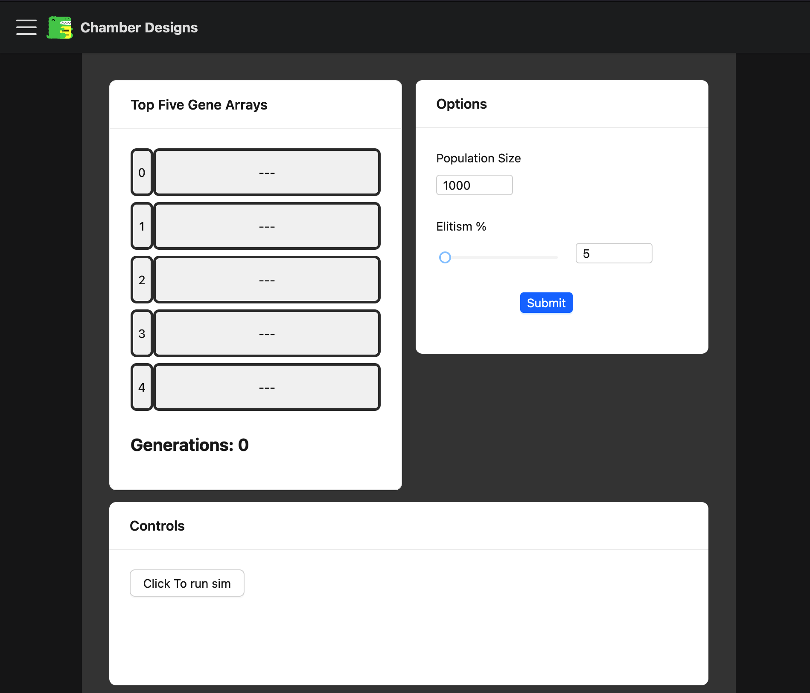

# TW-M Progress Update 06-01

## What I've Done

[See Project Post](./typewriting-monkeys)

I have had a bit of spare time today to dedicate to this project and have made some solid progress. Currently the GA is able, with hardcoded parameters, to actually run and output some results, a DNA class has been created as well, I have a primary entry point file that will act as an intermediary between the front end and the algorithm.

<!-- truncate -->

Along with getting the algorithm complete and working, in it's earliest form, I have also started to build up the front end of the project. I have a basic layout in place and have started to add in some of the functionality. I have also started to think about how I want to structure the project and have decided to go with a modular approach.

In order for me to be able to maximise the possible updatable parameters in the GA, I am going to reconstruct the primary file so that a collection of methods can be passed in for things like selection, mutation, crossover etc. This will allow me to easily swap out different methods and test the effects of different approaches. Hooking up their selection to the UI when they are added.

> First rough draft of the front end, I haven't even gotten rid of the docusaurus logo yet!

## What I'm Going to Do

I will continue to build up the front end and make sure things get hooked up properly, once I have that in place, I can start to think about all the different methods I want to include in the simulator. Another thing to start considering after setting up my architecture for the project, is what I want to do about being able to quick-load different parameter settings for the GA. Initial thoughts are leaning towards implementing some sort of hash key that can be loaded in and will set all the parameters to the correct values as stored in the users key. Anyway, thoughts for another day!
