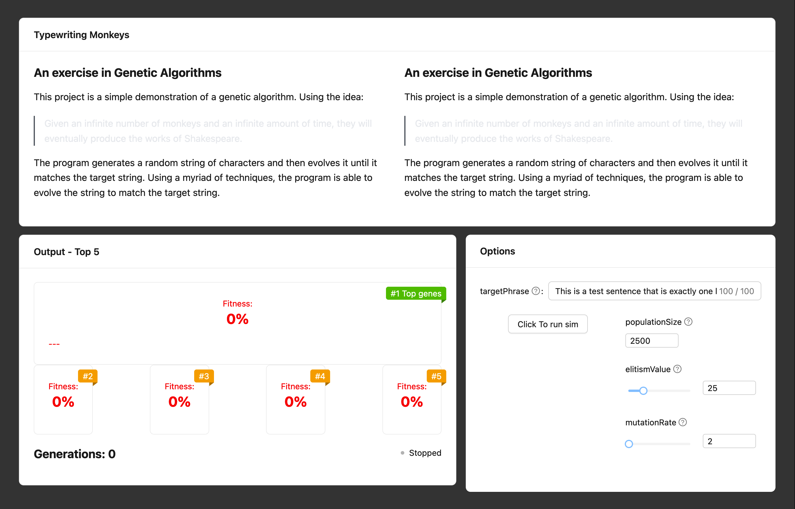

# TW-M Progress Update 07-01

[See Project Post](/blog/projects/typewritingMonkeys/typewriting-monkeys)

## What I wanted to achieve

At the end of yesterday I mentioned that I wanted to continue building up the frontend, hooking up the settings form to the pseudo-backend and start to think about the different methods I want to include in the GA.

## What I've Done

While I did manage to continue building up the frontend, and also completing the work to hook up the settings form to the backend, I didn't get around to thinking about the different methods I want to include in the GA. Working on the frontend took a little longer than anticipated, but that did mean that I had some extra time to think about what I was doing while I was doing it.

Today's updates mostly included rearranging some of the files, so that all project files are together underneath `~/pages` instead of spread out across my repository.

I also started putting together some more generic and reusable components for the UI, I would love to get these into the parent monorepo's UI library, so I can reuse them across all of my projects, however it was proving difficult at first attempt, so I will have to come back to that at a later date when I have more components added or want to start using them in a different project.

In addition to architectural changes, I have made a large handful of UI changes. These include:

- Adding a `BlurbCard` at the top of the page to give a brief overview of the project and link to relevant pages. (Project Post, GitHub Repo, etc.)
- Adding a `SettingsCard` to the page, this is where the user will be able to set all of the parameters for the GA. Included in this is also now the control panel, currently only containing a 'Start' button, but will eventually contain a 'Pause' and 'Stop' button as well with any luck.
- Consolidated an `OutputCard` that contains the list of top five performing members of the population, as well as the current generation number.
  - Extra changes to this:
    - Added a `Fitness` component that displays the given fitness of the member.
    - Am now only showing the phrase of the top #1 member of the population, instead of all five.
    - Showing only the `fitness` of #s 2-5.
    - Added a `RunningIndicator` component that will display a pulsing blue dot when the GA is running, and a grey dot when it is not.
    - Added a `Ribbon` to the top right corner of each of the members, simply displaying their rank. (1-5)

You can see all these changes here, the blurb text is just a placeholder so I could visualise what two columns would look like and make any adjustments to the layout if necessary.

## What I'm Going to Do
